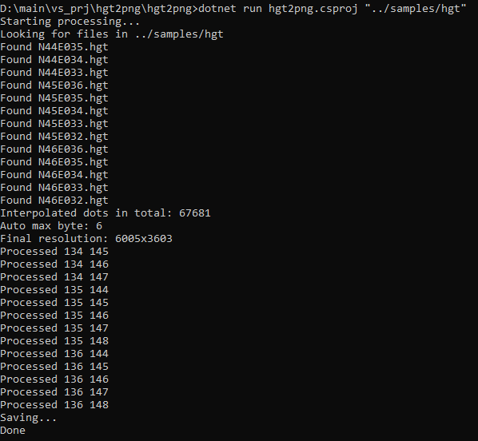
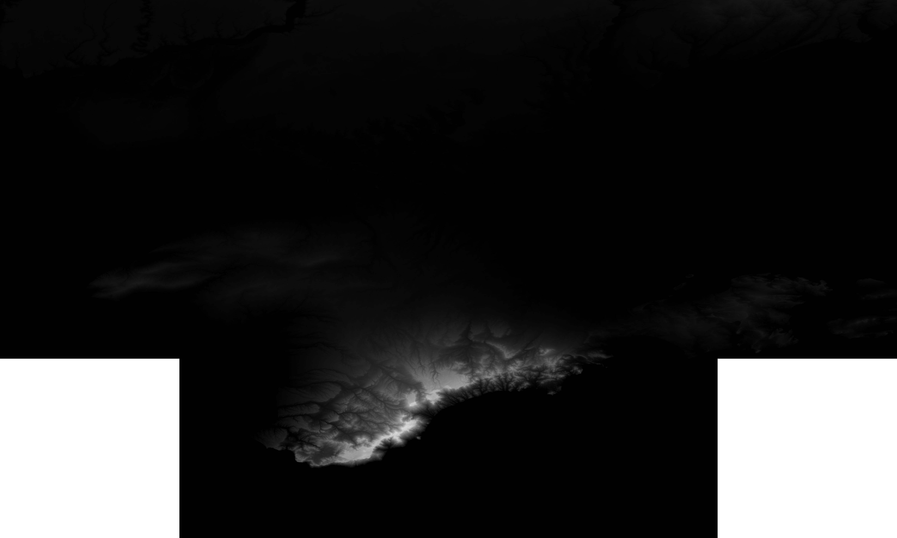

# Hgt2png

Cross-platform tool for transforming hgt files into 32-bit and 64-bit pngs.

By <a href="https://github.com/WhiteBlackGoose">WhiteBlackGoose</a> and <a href="https://github.com/MomoDeve">MomoDeve</a>.

## Installation

```
git clone https://github.com/WhiteBlackGoose/hgt2png
cd hgt2png/hgt2png
dotnet build hgt2png.csproj
```

## Usage


Consider <a href="./samples/hgt">these files</a>.

```
dotnet run hgt2png.csproj "../samples/hgt"
```

It will gather all the files with the appropriate naming (e. g. N44E033):



and pack into one 32-bit image:



as well as a more precise 64-bit image:


You can specify the path and prefix

```
dotnet run hgt2png.csproj "../samples/hgt" "../samples/res/some_random_prefix"
```

Finally, you can specify maxbyte. It's needed when you independently process images within multiple executions, and since you need the same
maxbyte, you first process those folders you need separately, then take the highest maxbyte and specify:

```
dotnet run hgt2png.csproj "../samples/hgt" "../samples/res/some_random_prefix" -maxbyte 5
```

#### Interpolation

Sometimes there are broken dots (whose first byte is 255 or 128). Hgt2png interpolates them with the average of all non-broken dots around. If all dots around are broken,
it sets the broken dot to 0.